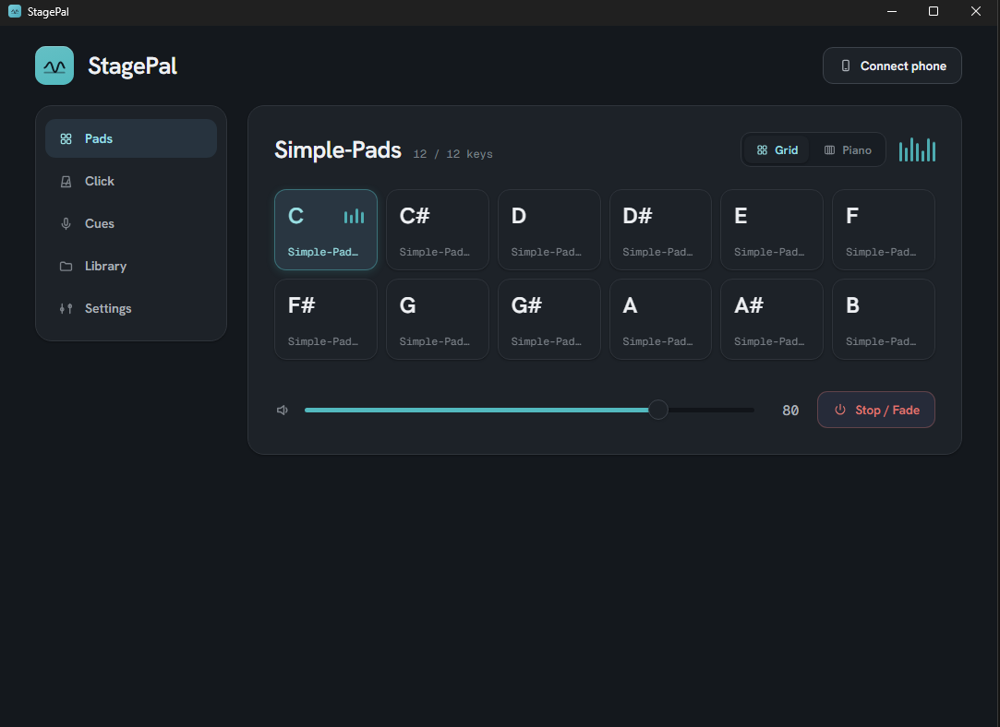
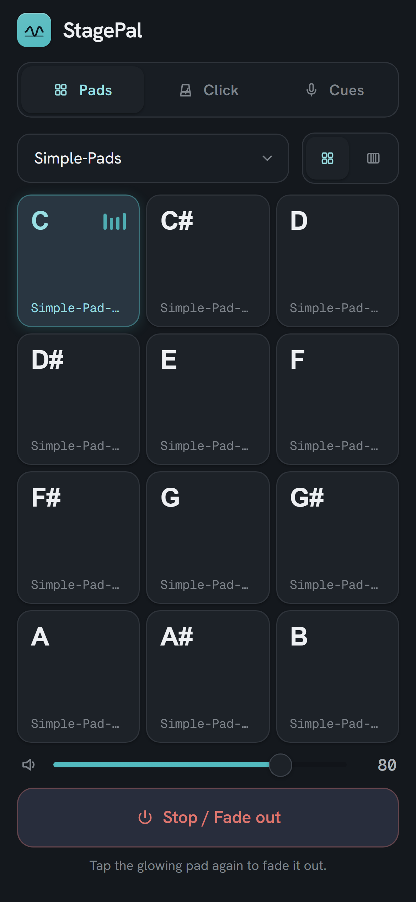

<p align="center">
  
</p>

<h1 align="center">StagePal</h1>

A Tauri desktop app that plays looping pads, a click track,
and spoken cues locally and routes each to specific channels of any
audio interface (via ASIO), while your phone acts as a wireless remote.

<p align="center">
  
  &nbsp;
  
</p>

## Features

- **Pad library** - point it at a folder of audio files; keys are matched
  from the file names, with a resolver for anything that doesn't auto-match.
  Multiple folders can be saved as presets and switched at any time.
- **Crossfade** between pads and on stop/fade-out.
- **Click track** with BPM, beats-per-bar, accent, and tap tempo; Space
  starts/stops it from any page.
- **Spoken cues** - pre-built quick cues and free-form text, spoken via the system TTS voices. 
- **Phone remote** - scan a QR code to open a one-handed remote on any phone on the same network.

## Development

Requires Node and a Rust toolchain set up for [Tauri 2](https://tauri.app/start/prerequisites/).
The default build links ASIO via `cpal`, so it also needs the Steinberg ASIO SDK
and `libclang` on `PATH`; pass `--no-default-features` to skip ASIO.

```bash
npm install
npm run tauri dev
```
